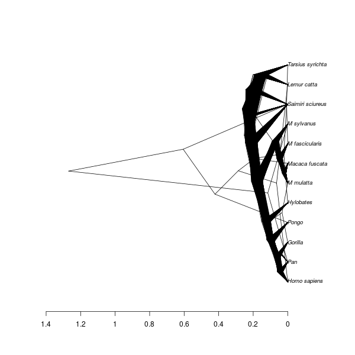

# babette_example_3

Branch   |[](https://travis-ci.org)                                                                                           |[](https://appveyor.com)                                                                                               
---------|--------------------------------------------------------------------------------------------------------------------------------------------------------|--------------------------------------------------------------------------------------------------------------------------------------------------------------------------------------------
`master` |[](https://travis-ci.org/richelbilderbeek/babette_example_3) |[](https://ci.appveyor.com/project/richelbilderbeek/babette-example-3/branch/master)
`develop`|[](https://travis-ci.org/richelbilderbeek/babette_example_3)|[](https://ci.appveyor.com/project/richelbilderbeek/babette-example-3/branch/develop)

A [babette example](https://github.com/richelbilderbeek/babette_examples).

## Example #3: JC69 site model


```
posterior <- bbt_run(
  "my_alignment.fas",
  site_model = create_jc69_site_model()
)
```

All other parameters are set to their defaults, as in BEAUti.

## Result


